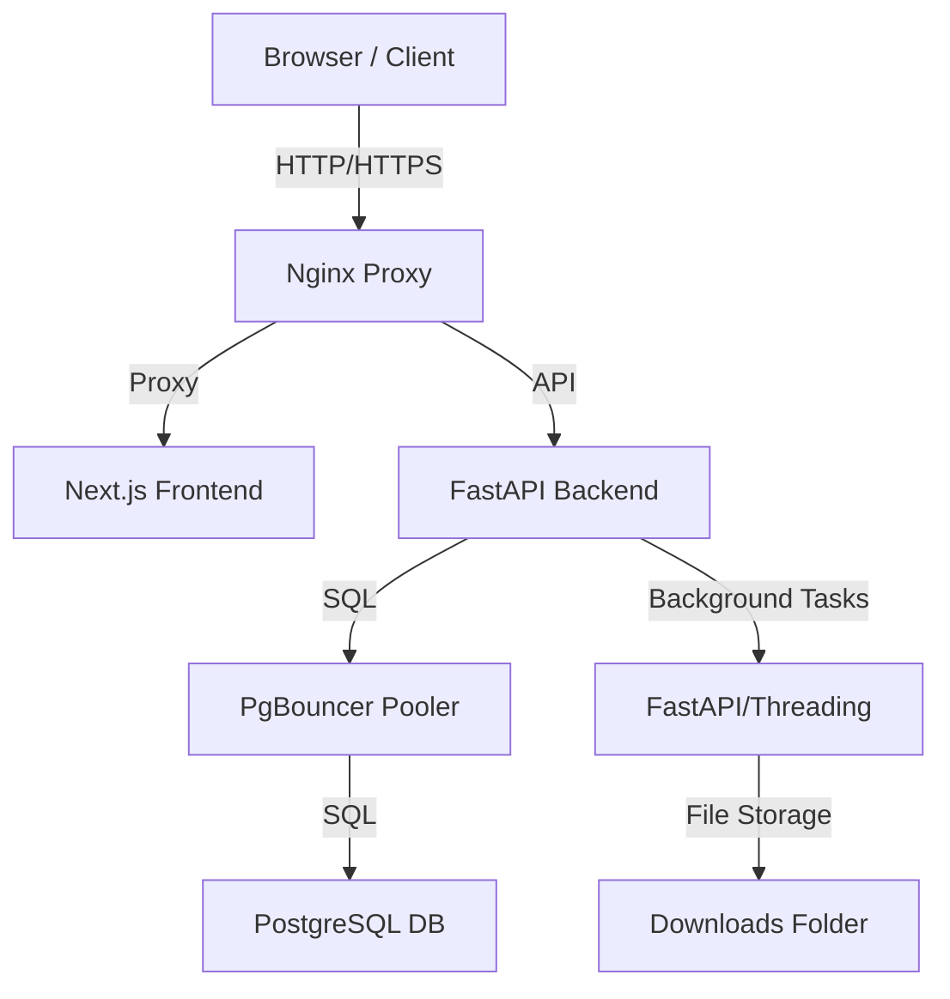

# ARCHITECTURE.md - FFP Data Validator

## System Overview

The FFP Data Validator is a containerized web application designed for high-performance processing and validation of national food program records.

## Core Components

- **Frontend**: Next.js (TypeScript) - Responsive dashboard for statistics and data upload.
- **Backend**: FastAPI (Python) - High-concurrency API service using `Pandas` for data validation and `XlsxWriter`/`WeasyPrint` for exports.
- **Database**: PostgreSQL 15 - Stores persistent geodata, validation results, and audit logs.
- **PgBouncer**: Manages database connection pooling to handle high-frequency API requests.
- **Nginx**: Handles reverse proxying, SSL termination (if configured), and serves as a firewall/load balancer.

## Deployment

- **Containerization**: Managed via `docker-compose.prod.yml`.
- **Infrastructure**: Production stack includes health checks and memory limits for the backend to handle large Excel files efficiently.
